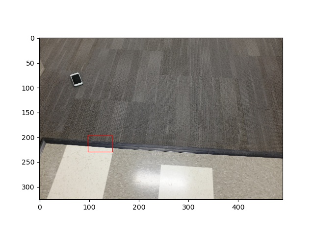
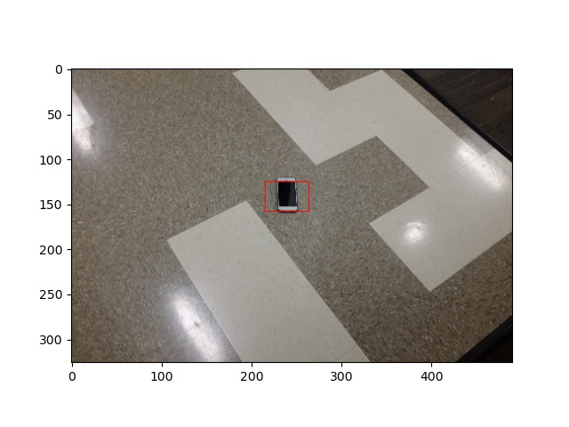
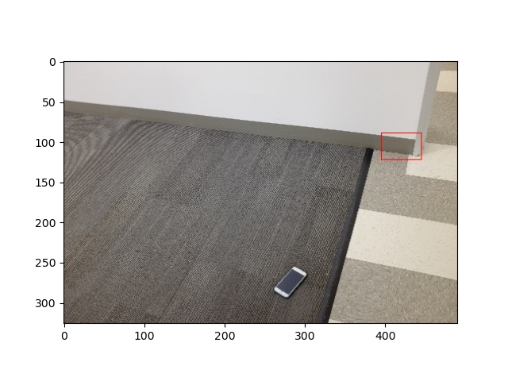
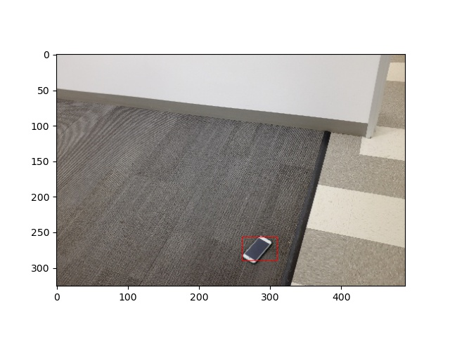
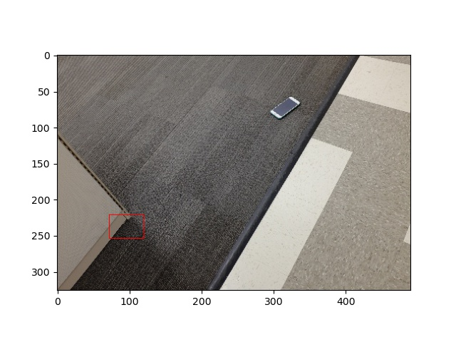
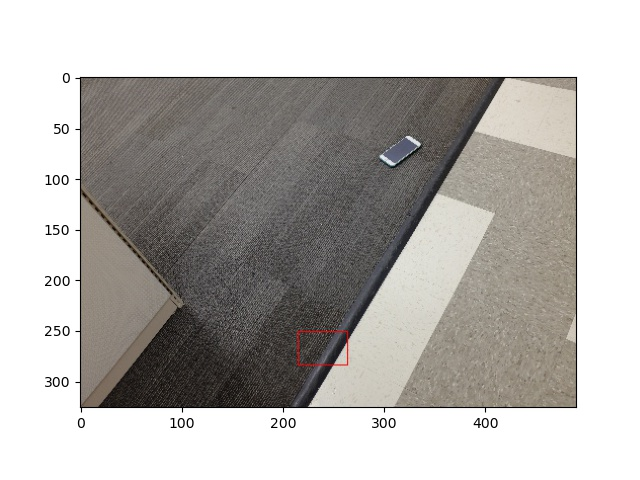
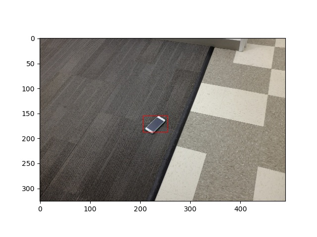

# Phone Detector
The aim is to detect a phone in the floor. It is assumed the phone type is the same across all images. The output is the normalized phone center coordinates. 

## Environment setup 
The code is setup in a conda environment. Make sure you have Anaconda installed in the system (visit ```https://docs.anaconda.com/anaconda/install/``` for installation details in appropriate system). Once Anaconda is installed and verified to be working in the system, you can clone the project environment using the bcorp.yaml file provided as follows <br>
```conda env create -f bcorp.yaml``` <br>

This will create a conda environment named ```bcorp``` and install all required dependencies to run the project. To run, we first activate the conda environment as follows : <br>
```conda activate bcorp``` <br>

Now we can run the code. 

## Directory structure
The file structure is as follows : <br>
```
├── data
│   └── find_phone
├── models
├── results
│   ├── images_ConvNet
│   └── images_LogisticRegression
└── src
    ├── find_phone.py
    ├── train_phone_finder.py
    └── utils.py
```

### 1. data/find_phone
This folder contains the dataset provided with the images and a labels.txt file that contains the ground truth phone coordinates for each image. 

### 2. models
This folder contains our trained models for the phone detection task. One of them is ```classifier.pkl``` that is the trained LogisticRegression model, and the other one is ```conv_net_1.pt``` that contains the trained deep learning network model. 

### 3. results
This folder contains the results of our phone detection algorithm. Subfolder ```images_ConvNet``` contains the bounding box images for the dataset using the trained deep learning network mode, ```images_LogisticRegression``` contains the same for the LogisticRegression model. ```labels_ConvNet.txt``` and ```labels_LogisticRegression.txt``` contain the predicted normalized phone coordinates for the images provided in the dataset. 

### 4. src
This folder contains the code for data preparation, the training code, and the code for testing the algorithm. ```utils.py``` contains code that provides helper functions to prepare the dataset. ```train_phone_finder.py``` contains the code for training the phone detection algorithm. ```find_phone.py``` contains the code to test the algorithm on images as well as find the accuracy on the provided dataset. 

## Usage
### 1. train_phone_finder.py 
This code is used to train the phone detection algorithm. We provide two different detection algorithms. One is a LogisticRegression model and another is a custom Deep Learning Convolutional Network model. Both of these methods in core divide the images into multiple windows and does a Categorical Classification among two classes : 0 indicating that the window does not contain any phone, whereas 1 indicating that the window contains a phone. 

The code takes in as arguments the folder where the images and labels.txt file are located, and additionally an argument that takes in the method we want to use. Enter 1 for logistic regression, 2 for deep learning network. <br>
```python3 src/train_phone_finder.py ~/find_phone 1``` <br>
OR <br>
```python3 src/train_phone_finder.py ~/find_phone 2``` <br>

### 2. find_phone.py
This code tests the phone detection model trained using the above code. Again the code takes in as arguments the test images location and additional argument for the model with 1 for logistic regression model and 2 for deep learning network. <br> 

```python3 src/train_phone_finder.py ~/find_phone_test_images/xxx.jpg 1``` <br>
OR <br>
```python3 src/train_phone_finder.py ~/find_phone_test_images/xxx.jpg 2``` <br>

where ```xxx``` is the test image number you want to test the image on. Additionally the code also outputs the overall accuracy of the trained model on the provided dataset. Here attached is a sample output of the code testing on a given image in the dataset. 

(bcorp) $ python3 src/find_phone.py ~/find_phone_test_images/20.jpg 2
0.3438775510204081 0.7663265306122449
100%|████████████████████████████████████████████████████████████████████████████████████████████████████████████████████████████████████████████████████| 130/130 [01:06<00:00,  1.94it/s]
Accuracy of algorithm on the dataset is : 96.153846%

## Results
We were able to achieve an accuracy of 92.30% using LogisticRegression and 96.15% using the Deep Learning Network. Below we attach a comparison of some results obtained using the two methods. <br>
<pre>             ||Logistic Regression||                ||Convolutional Network||</pre>

<p float="left">
  
   
</p>

<p float="left">
  
   
</p>

<p float="left">
  
   
</p>

<p float="left">
  
   
</p>

<p float="left">
  
   
</p>
